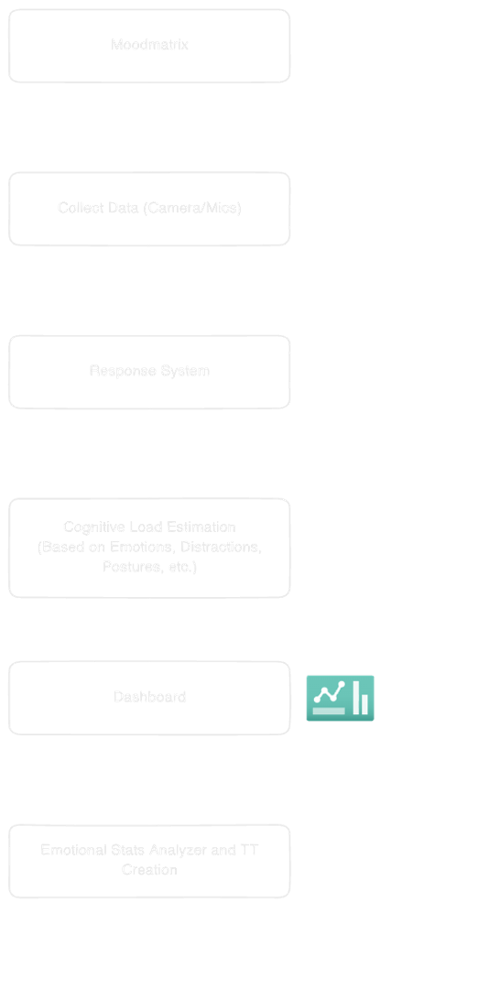
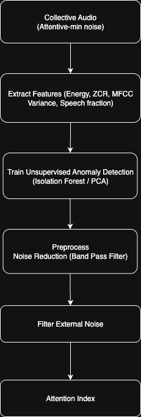
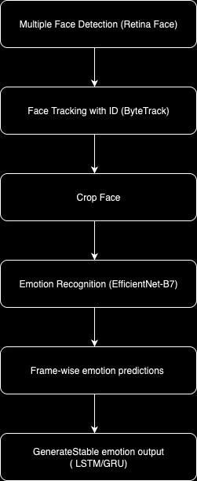

# MoodMatrix – AI-Powered Study Companion  

MoodMatrix is an **AI-powered emotion-aware study companion** designed to optimize learning, improve focus, and support students with real-time emotional intelligence. It integrates AI with IoT hardware to create a personalized and distraction-free study environment.  

---

## Features  
- **Emotion-Aware Study Companion** – Detects and adapts to your emotional state during study sessions.  
- **AI Tutor for Discussion** – Ask questions, clarify doubts, and get real-time guidance.  
- **Distraction Monitor** – Tracks posture, facial cues, and audio signals to minimize distractions.  
- **Motivational Friend** – Encourages and boosts morale throughout study sessions.  
- **Dynamic Time-Table** – Creates adaptive schedules with priority-wise task execution.  
- **Emotional Stats Analyzer** – Generates insights and personalized timetables based on mood data.  

---

## Tech Stack  

### **Hardware**  
- Jetson Nano  
- Camera (for facial & posture recognition)  
- Speaker & Microphone (for interaction)  

### **Software**  
- FastAPI
- HTML, CSS, JS
- Python
- TensorFlow, PyTorch
- MediaPipe
- OpenCV
- Librosa
- Scikit-learn
- NumPy, Pandas 

---


##  Block Diagram - Proposed Architecture Diagram  


##  Audio and Visual Cognitive Load Estimation Block Diagram  

<p align="center">
  
  
</p>


## Getting Started  

### 1. Clone the Repository  
```bash
git clone https://github.com/your-username/MoodMatrix-AI-Powered-Study-Companion.git
cd MoodMatrix-AI-Powered-Study-Companion
```


### 2. Set Up the Environment
```bash
python -m venv venv
source venv/bin/activate  # On Windows use `venv\Scripts\activate`

pip install -r requirements.txt
```

### 3. Download Pre-trained Models
Download the required pre-trained models and place them in the `models/` directory.
- [Pose Landmarker Model](https://ai.google.dev/edge/mediapipe/solutions/vision/pose_landmarker#models)
- [Face Landmarker Model](https://ai.google.dev/edge/mediapipe/solutions/vision/face_landmarker#models)

### 4. Run the Application
```bash
python backend/cognitive_load.py
```
